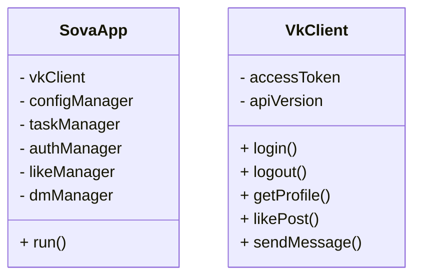

>Это проверка Feature branch
>1
>2
## Введение
>Пользование бесплатно платных услуг Vk

# Добро пожаловать, я Алан группы Is-31K, сегодня мы разберём как не переплачивать за VK музыку и слушать её бесплатно!
## Первым делом нужно скачать приложение [Sova](https://trashbox.ru/link/sova-v-re-android) 
>В крации приложение Sova это mod на Vk, который позволяет пользоваться платными услугами бесплатно.

## Диаграмма классов

## Activity диаграмма

#  Сценарий использования Sova VK Mod

1. Регистрация и авторизация
   - Пользователь скачивает и устанавливает Sova VK Mod на своем устройстве.
   - Пользователь вводит свои учетные данные ВКонтакте (логин и пароль) для авторизации в приложении.
   - Приложение запрашивает необходимые разрешения для взаимодействия с API ВКонтакте.

2. Настройка приложения
   - Пользователь заполняет основные настройки, такие как язык, часовой пояс, тематику аккаунта и т.д.
   - Пользователь настраивает шаблоны постов, расписание публикаций, критерии для лайкинга и отправки сообщений.
   - Пользователь подключает дополнительные аккаунты ВКонтакте (если необходимо) для многопрофильного режима.

3. Автоматизация активности
   - Приложение Sova VK Mod начинает выполнять запланированные публикации постов согласно расписанию.
   - Система автоматического лайкинга реагирует на новые публикации, комментарии и другие активности пользователей по заданным правилам.
   - Модуль автоматической отправки личных сообщений (DM) контактирует с новыми подписчиками или пользователями по заданным критериям.

## Диаграмма последовательности 

# Готово, тепреь вы можете слушать и скачивать музыку Бесплатно

